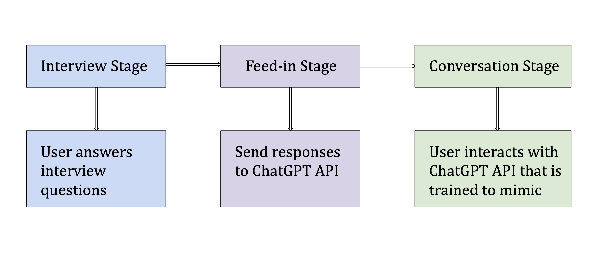

# CSCI 4970 – AI in Fiction & Fact
## Design Documentation

**Title:** IdentityBot

**Names:** Emma Clements (clemee3), Sam Francis (francs3), Annie Xu (xuj18)

**Github Link:** [IdentityBot Repository](https://github.com/AIFictionFact/F23_IdentityBot)

## Project Overview
IdentityBot aims to simulate conversations with virtual representations of people based on user descriptions. Leveraging the ChatGPT API, it offers personalized interactions, including emotional support and nostalgic conversations.

## Goals
- Develop a chatbot that excels at personalizing conversations based on user-provided descriptions.
- Deliver meaningful emotional support and engagement, providing users with companionship and therapeutic value.
- Recognize multiple user profiles and refer back to previous conversations, ensuring continuity.

## Related AI Projects
- **Replika.ai:** Released in 2017, Replika.ai is a chatbot based on the text messages of the creator's friend after their death.
- **Character.ai:** Introduced in beta form in 2022, Character.ai is a chatbot focused on conversations with fictional, historical, and celebrity characters.
- **ChatGPT:** Released in 2022, ChatGPT is an AI language model that uses natural language processing to provide assistance and information on a wide range of subjects.

## Functional Requirements
- **User Profile Creation:** Users can create profiles for the individuals they want to simulate conversations with, including their name, characteristics, and communication style.
- **Personalization:** The details from the user profiles will be given as parameters to the ChatGPT AI to influence how it responds to prompts.
- **Emotional Support:** The chatbot can offer comforting advice and support to provide companionship.
- **Conversation Tracking:** The chatbot can refer back to previous prompts and even previous conversations to ensure continuity.

## Non-functional Requirements
- **Quality User Interface:** The user interface will be intuitive and accessible for everyone.
- **Fast Response Times:** The chatbot will respond to user input within a reasonable time frame, with a goal of near-instantaneous replies.
- **Reliable:** The chatbot will be reliable, with robust error handling and recovery mechanisms to minimize interruptions.
- **Maintainable:** The chatbot will be developed with maintainability in mind, with clean code and comprehensive documentation, making it easy for developers to update and enhance the application in the future.

## System Architecture
The main components are Python and the OpenAI API. The user will enter answers to basic questions, which are processed in Python and passed to the OpenAI API, used to tune its parameters. Then Python uses the OpenAI API to start a conversation with the user, which consists of getting user input, processing it in Python, passing it to OpenAI API, fetching a response, and printing the response in Python. Python is used to store data associated with a user, such as the unique profiles associated with that user, and their conversation history. This data is used to train OpenAI to respond in a convincing way.

 

## Technologies to be Used
- **Python:** Script and Automation, Data Handling, API Integration, Backend Development
- **OpenAI API:** Language Model, Fine-Tuning, Conversation State Management, Sentiment Analysis
- **GitHub:** Version Control, Code Collaboration

## User Profiles
- **Grieving Family Members:** Seeking solace and remembrance through conversational memories.
- **Historians & Biographers:** Looking to capture and document the personality and stories of the deceased.
- **Therapy Clients:** Using the chatbot as a therapeutic tool to process grief and loss.
- **Former Colleagues and Peers:** Professionals who value the insights and mentorship they once received.
- **Close Friends:** Seeking to reminisce and experience the personality of the deceased.

## UI/UX Design
The UI will be very simple to make it easy for the user to understand the program. It starts with an Intro with a series of open-ended questions to capture the personality of the person. Once the interview stage is completed, it transitions to the conversation stage with a header providing basic information about the person and a chatlog of the conversation.

**Interview Stage:**
- PB: What is the name of the person?
- You: James
- PB: How does this James refer to you?
- You: Mike

**Conversation Stage:**
- James: Hey Mike! How’s it going?
- You: I’m doing good, how is your dog?
- James: He has as much energy as ever, he plays with his squeaky toy every day!

**GUI Development:**
- Add a simple GUI interface using an external library for Python.
- Planning to use Tkinter, PyQt, or Kivy for the GUI framework.
- Plan to Mimic Phone Texting Interface to offer a familiar and intuitive user experience.
- The GUI will include features like input fields for text, a display area for conversation history, and possibly send/receive buttons, resembling messaging apps.

## Team Roles
- **Emma – Lead Developer:** Responsible for developing the core components of the chatbot, including conversational and personalization features.
- **Annie – API Integrations:** Responsible for integrating, training, and tuning parameters for the external ChatGPT API.
- **Sam – Quality Assurance:** Responsible for testing functionality, identifying and reporting bugs, and ensuring overall quality.

## Technical Limitations
- **Limited Data Set:** We are only gathering details about a person through a questionnaire, so more intricate aspects of their verbal behavior might not be able to be recreated without a large data set like text messages or phone calls.
- **Privacy:** Using personal information about someone like text messages and phone calls could violate the privacy of those conversations as the person may not consent to their texts being seen by other people.
- **Lack of Real-Time Updates:** The personality of the chatbot will be static, meaning if the personality of this person evolves over time, the chatbot will not be able to know how this person has changed.
- **User Interface:** We have to figure out how to implement a user interface using Python. It may be a text-based user interface.
- **Difficulty Testing** Because of the long interview stage, it can be difficult to test the program. To solve this, we added an option to import text files with answers to the questions.
- **AI Fine-Tuning** It is difficult to train the OpenAI API to pretend to be someone else. Usually it will admit to being an AI. We are researching ways to improve this and get the AI to take on a different role.

## Test Plan
For testing, we will use mainly manual testing by the developers, because there are dynamic features such as responses that could change based on many factors, which are difficult to automatically test. We may develop some unit tests as well, using the Python unittest module, especially as we reach the end of the project.
We will generate test cases related to these features:
- Creation of multiple user profiles
- Personalization influencing responses
- Providing emotional support
- Tracking multiple conversations
- User interface

**Chatbot Response Accuracy:**
- Test how accurately the chatbot responds as if it were the subject described by the user.
- Use a set of predefined questions and evaluate if the responses align with the subject's expected personality and knowledge.
- Mostly manual testing.

**Few-Shot Fine Tuning Effectivenes:**
- Assess the impact of few-shot fine tuning on the bot's responses.
- Compare responses before and after fine-tuning with user and subject data.

**Sentiment Analysis Accuracy:**
- Test how well the chatbot identifies and responds to various sentiments in user inputs.
- Provide inputs with different emotional tones and evaluate the chatbot’s responses.

## Ethical Use Plan

- **User Consent and Privacy:** Inform users about data collection and usage, ensuring transparency in data handling and storage.
- **Bias and Fairness:**  Regularly test and update the model to eliminate biases and ensure fair treatment of all users.
- **Accuracy and Misinformation:** Continuously monitor and refine the model for accurate information and prevent the spread of misinformation.
- **Emotional Support and Psychological Safety:** Design empathetic interactions, clarifying the chatbot's role as supportive but not a substitute for professional help.
